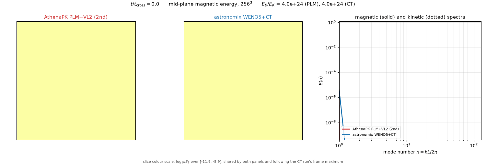
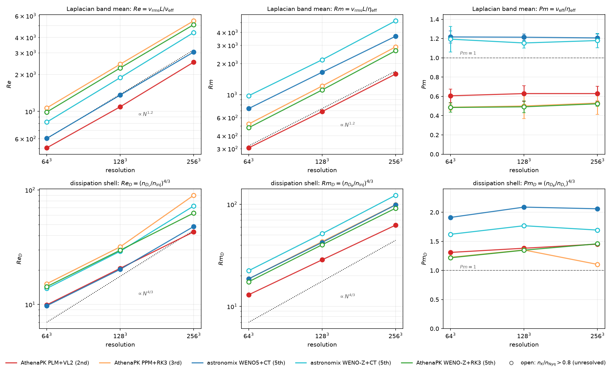
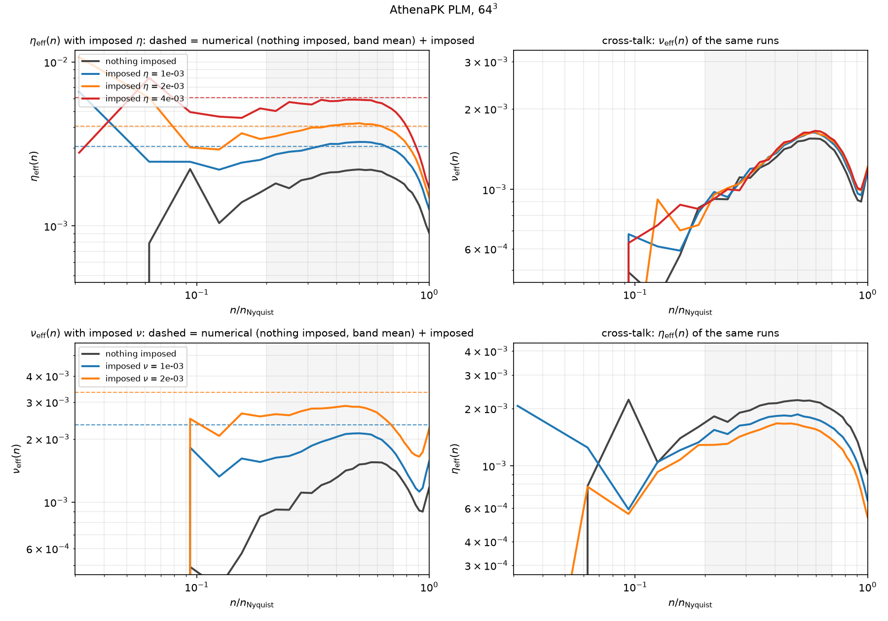
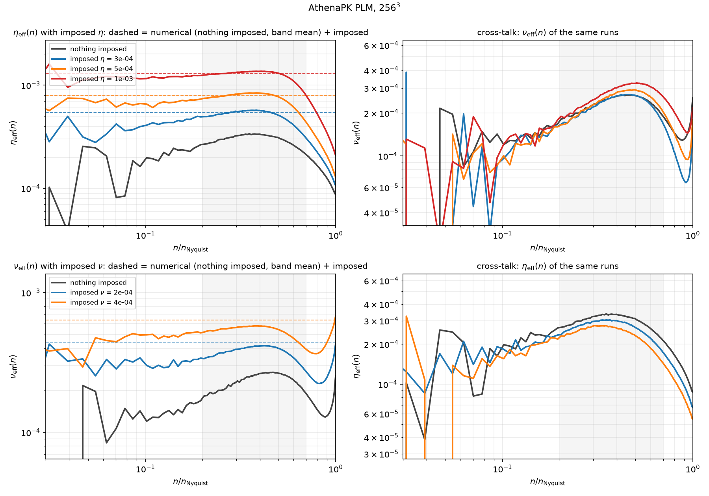
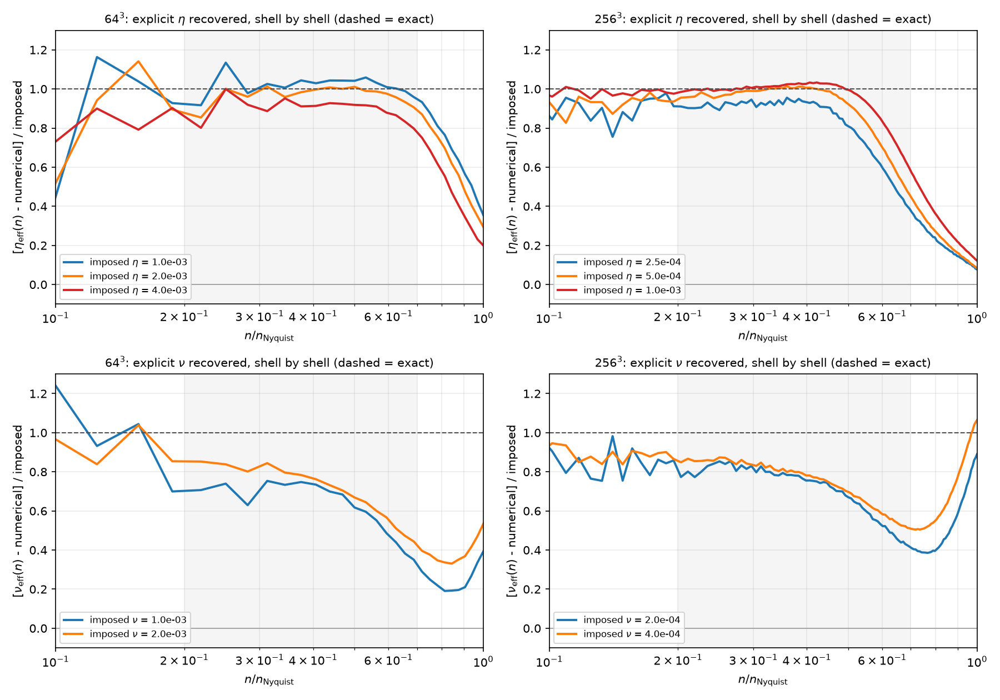
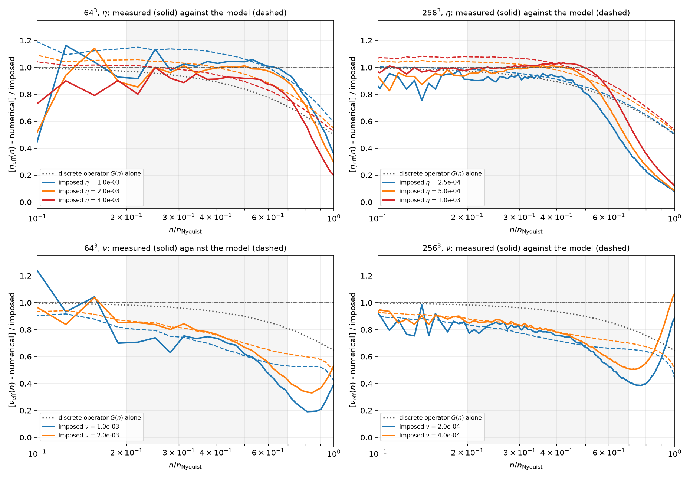
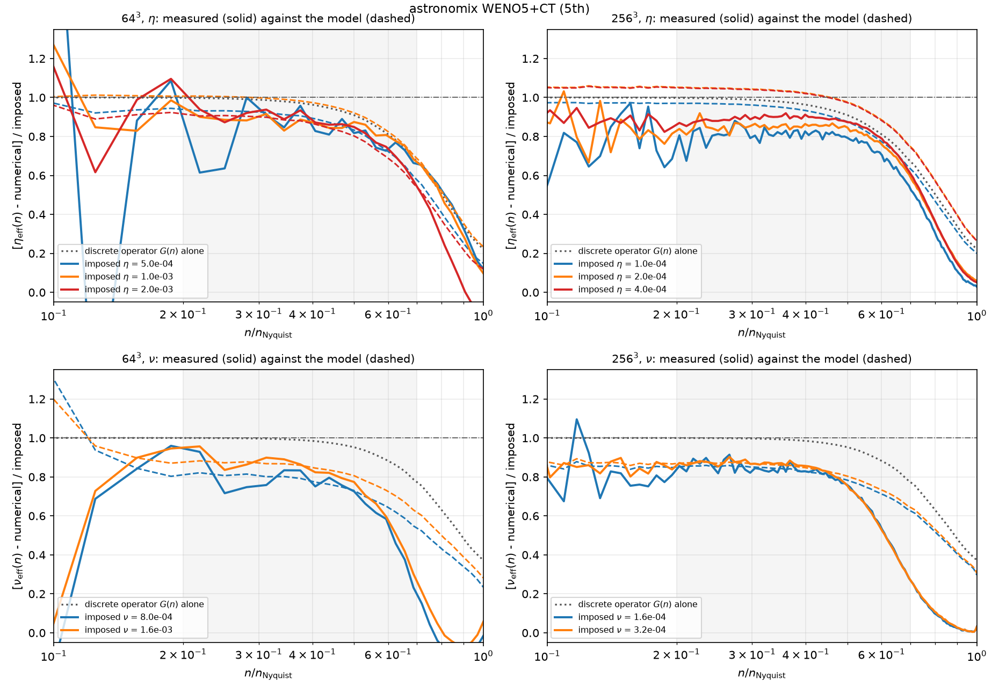
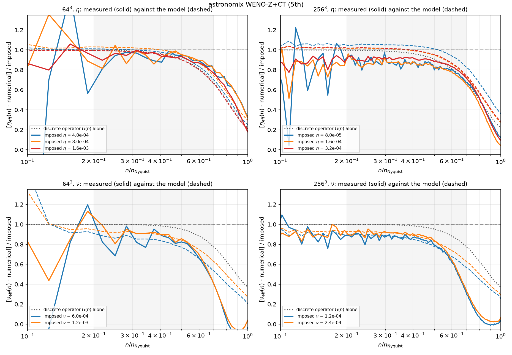
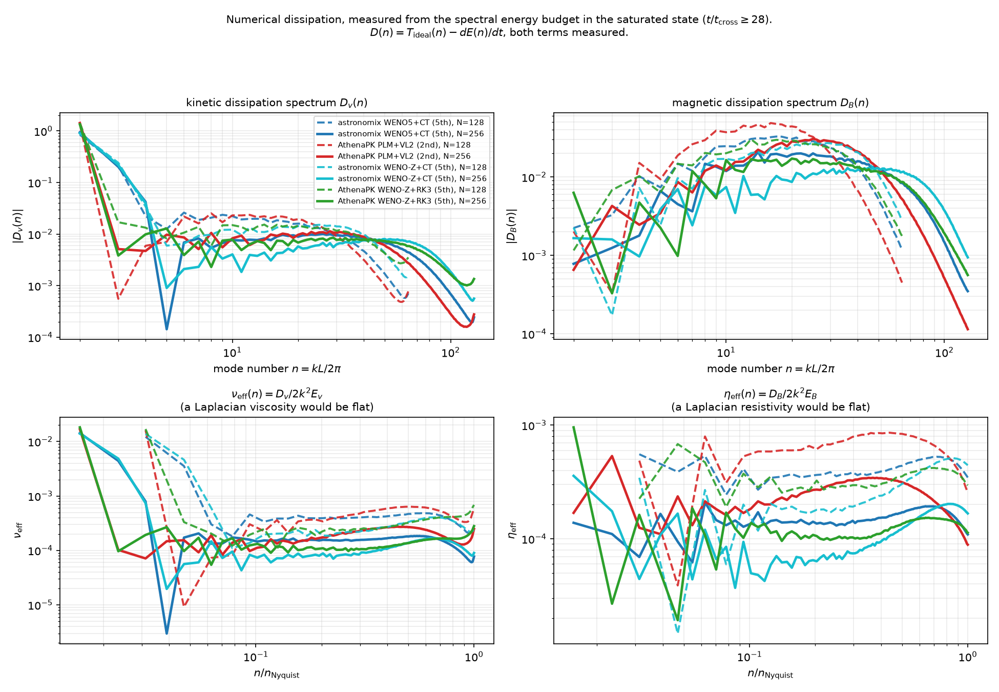
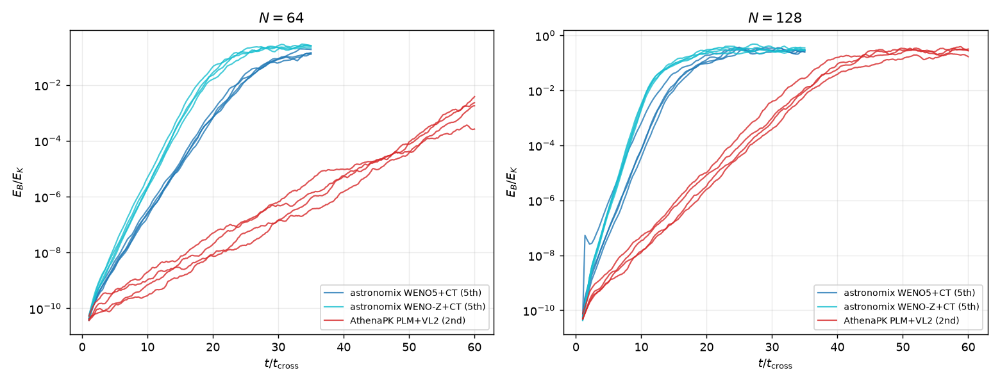

# Where the dynamo speed comes from

A driven subsonic MHD turbulence box run with two codes at `256^3`, and the
measurement of why one of them grows a magnetic field faster than the other.

**Summary of what is and is not established.** The numerical magnetic Prandtl
number `Pm = nu_eff / eta_eff` is a scheme constant, flat over a factor of four
in resolution, and it separates constrained transport (1.21) from GLM cleaning
(0.49-0.63) at any reconstruction order. That much is solid. It is *associated*
with a faster dynamo, and an explicit-viscosity intervention inside one code
reproduces the effect. But the advantage it buys shrinks with resolution
(2.15x -> 1.67x from `64^3` to `256^3`) while `Pm` does not, a
the growth rate at `64^3` scatters by 20% between forcing realisations — wider
than the collapse it is fitted to — and only two of the four schemes pass the
resolvedness test. **Read the
`Pm` split as a robust measurement and the causal story as incomplete.**

* **AthenaPK PLM+VL2+HLLD** — 2nd-order finite volume, GLM divergence cleaning
* **astronomix WENO5+SSP-RK4** — 5th-order finite difference, constrained
  transport

Same box, same forcing amplitude, same isothermal sound speed, matched on the
achieved flow rather than calibrated (`Mach` = 0.68-0.73 in every run quoted
here). Full setup, controls and caveats: [`README.md`](README.md).

## The two dynamos, side by side



Mid-plane magnetic energy at `256^3` (top row), on a shared logarithmic colour
scale spanning three decades below the constrained-transport run's frame
maximum, plus both magnetic spectra (solid) with the kinetic spectra behind them
(dotted, bottom left) and `E_B/E_K` against time for both runs (bottom right).
The spectrum and `E_B/E_K` axes are fixed for the whole animation, so the growth
is visible rather than normalised away; the slice colour scale is not, and the
`E_B/E_K` panel is where the absolute amplitude that the slices hide is read off.

What it shows, in order:

* **The kinetic spectra lie on top of each other** for the whole kinematic
  phase. Whatever separates these two runs is in the induction equation, not in
  the flow they carry.
* **The CT magnetic spectrum sits above the GLM one at every scale**, and the
  gap is widest at high `n`: at `t / t_cross = 6` the two are at
  `E_B/E_K` = 6.1e-2 and 2.5e-2, a factor 2.4, and the CT spectrum extends
  visibly further before turning over. The CT slice is correspondingly more
  filamentary at the grid scale.
* **By saturation the two spectra nearly overlie each other**, and the gap in
  `E_B/E_K` has narrowed: averaged over `t / t_cross >= 28` it is 0.305 (PLM)
  against 0.428 (CT), a factor 1.40, where at `64^3` the same comparison gives
  0.076 against 0.154, a factor 2.03.

Two cautions on reading the frames, both of which caught an earlier draft of
this section. **Instantaneous is not time-averaged:** at `t / t_cross = 36.7`
the frame shows 0.400 and 0.429, which looks like near-equality, but 0.400 is
essentially PLM's maximum over the whole saturated window (which spans
0.232-0.406, against 0.311-0.533 for CT). Pick a different frame and the ratio
looks quite different. **And the trend in the saturated level is not clean:** the
CT/PLM ratio is 2.03 / 1.18 / 1.40 at `64^3` / `128^3` / `256^3`, not monotone,
and the ±25-30% temporal fluctuation above is comparable to the differences
being compared. The growth rate, not the saturation level, is the quantity this
study can order reliably.

The animation runs do double as a reproducibility check, since they are separate
integrations of the same configurations with a different dump cadence: they
recover the table runs' growth rates to 0.4% (CT) and 2.6% (PLM) and their
saturated levels to 0.2%. Output cadence does not perturb these `256^3`
realisations meaningfully.

## How `Re`, `Rm` and `Pm` are measured

Neither code has an explicit viscosity or resistivity. They cannot be read off;
they have to be measured, and the only place they are visible is the spectral
energy budget.

### 1. Spectra

Shell-summed over integer mode numbers. Each mode is assigned to the shell
`n = rint(|k| L / 2pi)`, and the shell is labelled by `k = 2 pi n / L`:

```
E_v(n) = (1/2) sum_{rint(|k|L/2pi) = n} |v-hat(k)|^2
E_B(n) = (1/2) sum_{rint(|k|L/2pi) = n} |B-hat(k)|^2
```

normalised so that `sum_n E_v(n)` recovers `<|v|^2> / 2`, and likewise for `B`.

That recovery is **not exact**, for one reason: only shells `n = 0 .. N/2` are
kept, so the corners of the Fourier cube outside the inscribed Nyquist sphere —
about 45% of the modes — are discarded. On a synthetic `k^-5/3` field that costs
1.1-1.5%. On these runs it costs **0.010%**, because numerical dissipation has
already emptied the grid-scale modes where the corners live. Checked directly on
a stored `64^3` dump in float64: summing all modes gives Parseval to 1.000000,
summing the retained shells gives 0.999899, and float32 changes neither. The
shell spectra should still be read as truncated to the inscribed sphere rather
than as a closed budget over all modes, but the truncation is negligible here,
and the band used for the diffusivities (`n / n_Nyquist = 0.2` to `0.7`) is well
inside the sphere in any case.

An earlier version of the audit reported this ratio as 0.9915-**1.0020** — above
one, which a sum over a subset of non-negative modal energies can never be. That
was a fault in the diagnostic, not the estimator: it compared the time-averaged
spectrum against `(1/2) <v_rms>^2` instead of `(1/2) <v_rms^2>`, and Jensen's
inequality makes the first smaller by 0.08-0.21% — exactly the observed excess.
Compared like with like the ratio is 0.9990-1.0000 for every AthenaPK run.

astronomix sits slightly lower at the coarse grids — 0.9903 at `64^3`, 0.9932 at
`128^3`, 0.9991 at `256^3` — and the reason is a genuine difference between the
two setups rather than a diagnostic one: the shell sum here excludes `n = 0`, and
astronomix's box carries a net bulk drift holding 0.96% / 0.67% / 0.08% of the
kinetic energy, where AthenaPK's is 1e-4 because it subtracts the mean momentum
from the forcing every step. A uniform drift is a Galilean shift and does not
change the dynamo, but it does exercise a finite-difference scheme's advection
error, so it is worth recording. It shrinks with resolution while `Pm` does not,
so it is not what produces the `Pm` split.

Note `E_v` is the *velocity* spectrum, not the `rho`-weighted kinetic energy.
That is deliberate: it is what lets the forcing term below be band-limited
exactly.

### 2. The ideal transfer

The exact non-dissipative right-hand side, projected onto the field and
shell-summed:

```
T_B(n) = sum_shell Re[ B-hat*(k) . (curl(v x B))-hat(k) ]
T_v(n) = sum_shell Re[ v-hat*(k) . a-hat(k) ],
         a = -(v.grad)v - grad p / rho + (curl B) x B / rho
```

Both are evaluated on the stored fields, by the same routine for both codes, so
a difference in the answer is a difference in the solvers and not in the
diagnostics.

### 3. What the scheme threw away

For a field evolving under ideal MHD plus forcing plus whatever the
discretisation does,

```
dE(n)/dt = T(n) + F(n) - D(n)      =>      D(n) = T(n) - dE(n)/dt   for n >= 4
```

with `T(n)` measured per snapshot and `dE(n)/dt` from consecutive snapshots.
`D(n)` is everything the scheme removed that ideal MHD does not.

Two points about the forcing term `F(n)`:

* **Magnetic: there is none.** `dB/dt = curl(v x B)` is the complete ideal
  induction equation; nothing forces `B`. So `D_B` is, with no omitted term,
  *every* way the discretisation changed the magnetic energy that ideal MHD does
  not — which matters because `eta_eff` is what the whole result rests on.

  For a GLM code that residual also contains the cleaning coupling, because the
  evolved equation is `dB/dt = curl(v x B) - grad psi` and only the first term is
  in `T_ideal`. That is not something to argue about: AthenaPK dumps `psi`, so
  the omitted contribution can simply be measured
  (`measure_glm_psi_term.py`),

  ```
  T_psi(n) = sum_shell Re[ B-hat*(k) . (-i k psi-hat(k)) ]
  ```

  and since `dE_B/dt = T_ideal + T_psi - D_num`, the measured residual is
  `D_B = D_num - T_psi`, so `T_psi` *is* the error. Measured over the averaging
  band of a saturated `64^3` PLM run, `T_psi` is negative — the coupling is a
  weak **sink** of magnetic energy, as divergence cleaning should be — of
  magnitude **2.9e-6 in `eta` units, against a measured total of 2.03e-3, i.e.
  0.14%**. Because the budget attributes that sink to the scheme, `eta_eff`
  *overstates* the scheme's own numerical resistivity by 0.14%; correcting it
  would move `Pm` 0.14% *towards* CT. `psi` itself carries 1.0% of the magnetic
  energy.

  That bound is measured on one `64^3` PLM run and is not asserted for the other
  schemes or resolutions, which would need their own dumps kept. It is quoted
  because it is three orders of magnitude below the effect under discussion, not
  because it has been established as universal.

  Two weaker checks agree. The fraction of in-band shells with `D_B <= 0` is 0.00
  for every run in the ladder, so the residual never has the wrong sign for a
  sink; and varying the Dedner damping `glmmhd_alpha` by a factor of 25 (0.02,
  0.1, 0.5 at `64^3`) moves `eta_eff` by 3% and `Pm` by 2%. **A CT code has no
  such term at all.**
* **Kinetic: zero above `n = 3` to one part in `10^3`.** Both codes force the
  *velocity* equation with a band-limited acceleration. AthenaPK adds
  `dt rho a` to the momentum with `rho` untouched, so the velocity increment is
  exactly `dt a` regardless of how `rho` varies; astronomix adds `amp w` to the
  velocity directly. In both, the only per-step modifications of the stored
  acceleration field are a global scalar (`accel_rms / rms(a)`, and astronomix's
  `amp`) and the subtraction of a single constant per component to zero the net
  momentum, which touches only `n = 0`. Neither changes the Fourier support.
  AthenaPK's `Rescale` and `InjectBlob` would break this, but both are disabled
  in these runs (`rescale_once_at_time` and `inject_once_at_time` are left at
  their `-1` defaults, so the routines return immediately).

  Over one step `v-hat'(k) = v-hat(k) + dt a-hat(k)`, so mode by mode

  ```
  |v-hat'(k)|^2 = |v-hat(k)|^2 + 2 dt Re[v-hat*(k) . a-hat(k)] + dt^2 |a-hat(k)|^2
  ```

  Both new terms are evaluated *at the same k*: the quadratic one is
  `|a-hat(k)|^2`, not the transform of a real-space product, so it does not
  convolve the support outwards. Both therefore vanish wherever `a-hat` does,
  i.e. everywhere above `n = 3`, with no size estimate needed. The measurement
  is consistent: `D_v(n)` is strongly negative for `n <= 3` and positive from
  `n >= 4` outwards.

`dE/dt` is taken as `E d(ln E)/dt` with `ln E` centre-differenced. For pure
exponential growth `ln E` is linear in `t`, so this is exact — which matters in
the kinematic phase, where a shell can double between snapshots.

### 4. Diffusivities and the dimensionless numbers

If the discarded energy were Laplacian, `D(n) = 2 nu k^2 E(n)`. Inverting that
defines a scale-dependent effective diffusivity:

```
nu_eff(n)  = D_v(n) / (2 k^2 E_v(n))
eta_eff(n) = D_B(n) / (2 k^2 E_B(n))
```

averaged over `n / n_Nyquist = 0.2 to 0.7` — above the forcing and the outer
scale, below where the un-dealiased products contaminate. Then

```
Re = v_rms L / nu_eff        Rm = v_rms L / eta_eff        Pm = Rm / Re = nu_eff / eta_eff
```

with `L = 0.5`, the driving wavelength (both codes force at `n ~ 2` in a unit
box). `L` is a convention: every absolute `Re` and `Rm` scales with it, and it
is the convention the dynamo literature quotes `Rm_crit` with. **`Pm` does not
depend on it at all.**

### 5. Where the measurement is taken

At matched `E_B/E_K = 0.01`, not in each code's saturated state. Each scheme
saturates at its own magnetic energy fraction (0.08 to 0.43 across this ladder)
and `Pm` drifts with that fraction, so a saturated-state table partly measures
the saturation level rather than the scheme. At `E_B/E_K = 0.01` the field is
still passive and every run carries the same turbulence.

Read in the saturated state instead, every GLM scheme appears to march toward
CT as the grid is refined (PLM 0.639 / 0.708 / 0.793 at `64^3` / `128^3` /
`256^3`, against CT's flat 1.063 / 1.028 / 1.033). That apparent convergence is
entirely the rising saturation level. **A resolution study of this quantity read
in the saturated state would have produced the opposite conclusion.**

## Results



Two rows, one matched state (`E_B/E_K = 0.01`). **Top: the Laplacian band
mean**, the table's definition, `Re = v_rms L / nu_eff` with `nu_eff` the mean
of `D_v / 2k^2 E_v` over `n / n_Nyq = 0.2-0.7`. It is like-for-like only between
schemes whose `nu_eff(n)` is flat (filled markers); for a scheme whose
dissipation is steep the band mean is an extrapolation, which the open markers
flag. **Bottom: the dissipation-weighted shell of the measured `D(n)` itself**,
`n_D = sum n D(n) / sum D(n)` over `n >= 4`, converted with the Kolmogorov
convention `(n_D / n_inj)^(4/3)`. It assumes no functional form, so it can be
compared across flat and steep schemes alike, at the price of an absolute scale
that is a convention. The numbers behind the bottom row:

| scheme | N | `Re` | `Re_D` | `Rm` | `Rm_D` | `Pm` | `Pm_D` | `n_{D_v}/n_Nyq` | `n_{D_B}/n_Nyq` |
|---|---|---|---|---|---|---|---|---|---|
| AthenaPK PLM+VL2 | 64 | 505 | 9.9 | 306 | 13.0 | 0.61 | 1.31 | 0.35 | 0.43 |
| AthenaPK PPM+RK3 | 64 | 1068 | 15.2 | 520 | 18.6 | 0.49 | 1.22 | 0.48 | 0.56 |
| AthenaPK WENO-Z+RK3 | 64 | 989 | 14.3 | 480 | 17.4 | 0.49 | 1.22 | 0.46 | 0.53 |
| astronomix WENO5 (JS) | 64 | 604 | 9.8 | 735 | 18.6 | 1.22 | 1.91 | 0.35 | 0.56 |
| astronomix WENO-Z | 64 | 819 | 13.8 | 977 | 22.4 | 1.19 | 1.62 | 0.45 | 0.64 |
| AthenaPK PLM+VL2 | 128 | 1092 | 20.7 | 687 | 28.6 | 0.63 | 1.38 | 0.30 | 0.39 |
| AthenaPK PPM+RK3 | 128 | 2427 | 31.9 | 1213 | 43.1 | 0.50 | 1.35 | 0.42 | 0.53 |
| AthenaPK WENO-Z+RK3 | 128 | 2260 | 29.8 | 1111 | 40.2 | 0.49 | 1.35 | 0.40 | 0.50 |
| astronomix WENO5 (JS) | 128 | 1359 | 20.3 | 1650 | 42.4 | 1.21 | 2.09 | 0.30 | 0.52 |
| astronomix WENO-Z | 128 | 1886 | 29.2 | 2177 | 51.6 | 1.15 | 1.77 | 0.39 | 0.60 |
| AthenaPK PLM+VL2 | 256 | 2520 | 43.1 | 1585 | 62.6 | 0.63 | 1.45 | 0.26 | 0.35 |
| AthenaPK PPM+RK3 | 256 | 5468 | 90.0 | 2901 | 99.3 | 0.53 | 1.10 | 0.46 | 0.49 |
| AthenaPK WENO-Z+RK3 | 256 | 5093 | 62.9 | 2664 | 91.7 | 0.52 | 1.46 | 0.35 | 0.46 |
| astronomix WENO5 (JS) | 256 | 3046 | 48.0 | 3675 | 98.9 | 1.21 | 2.06 | 0.29 | 0.49 |
| astronomix WENO-Z | 256 | 4393 | 72.5 | 5181 | 122.9 | 1.18 | 1.69 | 0.39 | 0.58 |

**The top row against a known coefficient.** Before reading either row, the
one test whose answer is known in advance: AthenaPK PLM with an explicit
Laplacian added (`data/calibration/`, `--ohm-diff` and `--mom-diff`), at `64^3`
and at `256^3` with the ladder scaled to each grid's own numerical
coefficients (imposed = 0.5x, 1x, 2x numerical for `eta`; 0.7x, 1.4x for `nu`).
A Laplacian is a flat line in `nu_eff(n)` and `eta_eff(n)`, lifted by the
imposed value:





| N | imposed | band-mean rise over "nothing imposed" | rise / imposed | step increment | other field |
|---|---|---|---|---|---|
| 64 | `eta` = 1e-3 | 1.02e-3 | **1.02** | 1.02 | `nu` +4% |
| 64 | `eta` = 2e-3 | 1.94e-3 | 0.97 | 0.92 | `nu` +4% |
| 64 | `eta` = 4e-3 | 3.59e-3 | 0.90 | 0.82 | `nu` +5% |
| 64 | `nu` = 1e-3 | 6.2e-4 | 0.62 | 0.62 | `eta` -17% |
| 64 | `nu` = 2e-3 | 1.38e-3 | 0.69 | 0.76 | `eta` -26% |
| 256 | `eta` = 2.5e-4 | 1.97e-4 | 0.79 | 0.79 | `nu` -2% |
| 256 | `eta` = 5e-4 | 4.35e-4 | 0.87 | 0.95 | `nu` +6% |
| 256 | `eta` = 1e-3 | 9.36e-4 | 0.94 | **1.00** | `nu` +19% |
| 256 | `nu` = 2e-4 | 1.36e-4 | 0.68 | 0.68 | `eta` -12% |
| 256 | `nu` = 4e-4 | 2.88e-4 | 0.72 | 0.76 | `eta` -22% |

("step increment" is the rise between consecutive rungs per unit imposed,
`make_mechanism_table.py --calibration`; the numerical `eta` at `256^3` is
2.95e-4 with nothing imposed, `nu` 2.37e-4.)

What the spectra show that the band means cannot, at both resolutions:

* **The imposed curves are flat where the numerical one is not.** Once a real
  Laplacian carries the dissipation the scheme's own contribution, which rises
  towards Nyquist, is a smaller share, and the shape is the Laplacian's. At
  `256^3` this is the more striking, because there the numerical
  `eta_eff(n)` rises by a factor two across the band while the imposed curves
  sit on plateaus at the expected values.
* **The estimator is additive once the Laplacian dominates, and the numerical
  part is displaced by 20-25% as soon as one is present.** The two
  resolutions show the same thing in different order. At `64^3` the numerical
  `eta_eff(n)` is already flat, so the first rung (imposed comparable to
  numerical) is recovered to 2% and the displacement appears as the later
  increments fall to 0.92 and 0.82. At `256^3` the numerical `eta_eff(n)` is
  the steeper one, so the first rung -- an imposed `eta` of *half* the
  numerical -- already flattens it and recovers only 0.79; after that the
  increments are 0.95 and **1.00**, i.e. exactly additive, with the residual
  numerical `eta` settled at 2.3e-4 (from 2.95e-4). In both cases the total
  displacement of the numerical part is 20-25% and then stops. The `nu`
  ladders agree between resolutions to within 0.06 per unit (0.62 / 0.76
  against 0.68 / 0.76): the scheme's numerical viscosity gives way to an
  imposed one by about a third, at both grids.
* **The cross-talk is one-sided at `64^3` and two-sided at `256^3`.** Imposed
  `eta` leaves `nu_eff(n)` unchanged at `64^3` (+4-5%) but raises it by 19% at
  `256^3` for the largest rung, where the imposed `eta` is twice the numerical
  one and the field is smooth enough to change the flow it drives; imposed `nu`
  lowers `eta_eff(n)` by 17-26% at both. A smoother velocity field tangles the
  field less and the scheme dissipates less of it -- the same displacement,
  read on the other field.

**The explicit part alone.** Subtracting the nothing-imposed `eta_eff(n)` and
`nu_eff(n)` shell by shell from each imposed run and dividing by the imposed
coefficient isolates what the estimator returns for the Laplacian itself; an
additive estimator gives a flat line at one:



* **`eta` is recovered exactly, up to half of Nyquist.** At `256^3` the two
  larger rungs sit on 1.00 across `n / n_Nyq = 0.1-0.5`, the smallest rung on
  0.90-0.95; at `64^3` the first rung is on 1.0 and the largest on 0.9. Above
  ~0.5-0.6 of Nyquist every curve rolls off, to 0.1-0.3 at Nyquist. So the
  20% displacement of the numerical part seen in the band means is *not*
  spread over the band: it is the grid scales, where the scheme's own
  dissipation lives, giving way to the explicit one. The band (0.2-0.7)
  reaches into that roll-off, which is where the 0.79-0.94 band-mean recovery
  at `256^3` comes from; over 0.2-0.5 alone the recovery is 0.95-1.00. A
  narrower band would calibrate `eta` better at the price of fewer shells and
  a larger bootstrap error; the study's numbers are left on 0.2-0.7, with
  this as the quantified cost.
* **`nu` is recovered incompletely at every scale, and less so towards the
  grid.** 0.85-0.9 at the large-scale end of the band, falling to 0.7-0.8 at
  0.5 of Nyquist and to 0.4 at 0.8 (both resolutions, both rungs), with an
  upturn at Nyquist itself. Unlike `eta`, this is not confined to the grid
  scales: an imposed viscosity smooths the velocity field the scheme is
  advecting, and the scheme's own `nu_eff(n)`, which rises with `n`, is
  reduced across the whole range. The `nu` measurement therefore carries a
  10-30% low bias relative to a true Laplacian everywhere in the band, which
  is what the 0.62-0.76 per unit in the table means scale by scale.

**Why `nu` and not `eta`.** Write the shortfall at each shell as a fraction of
the numerical coefficient there, `recovered(n) = 1 - f(n) nu_num(n) / nu_imp`.
For `nu`, `f` is 0.2-0.35 across the lower half of the band and rises to
0.6-1.1 near the grid, the same at both resolutions and both rungs; for `eta`
it is 0.00 ± 0.05 up to half of Nyquist and only then rises. So an imposed
viscosity displaces a fixed quarter to a third of the scheme's numerical
viscosity at *every* scale, while an imposed resistivity displaces none of the
numerical resistivity except at the grid. The amplitude of the field is not
what does it: imposed `eta` cuts `E_B(n)` in the band by 3x to 30x and the
recovery stays at 1.00, while imposed `nu` cuts `E_v(n)` by only 2x and the
recovery falls. What differs is *which field was smoothed*. The numerical
dissipation of a Godunov scheme -- of both fields -- is set by the grid-scale
structure of the **velocity**: the momentum flux `rho v v` is quadratic in `v`
and the induction flux `v x B` is linear in `v`, so their truncation terms scale
with velocity gradients, not with `B` gradients. Smoothing `v` therefore lowers
the numerical `nu` *and* the numerical `eta` (the cross-talk: imposed `nu`
lowers `eta_eff` by 12-26%, the same fraction as `f`); smoothing `B` leaves the
velocity, and with it both numerical coefficients, alone (imposed `eta` moves
`nu_eff` by +4-6%, except at `256^3` with `eta` twice numerical, where the
back-reaction on the flow at `beta = 100` is changed enough to move it +19%).
The `nu` calibration therefore does not fail; it measures the non-additivity of
numerical and explicit viscosity, which is 25-35% in the band. For the study's
own numbers, all schemes carry the same flow, so their `nu_eff` are comparable
with each other; the bias applies when reading them as a Laplacian a physical
fluid would have, and is 15-30% low for `nu` against 0-10% for `eta`.

**A model of the calibration** (`make_calibration_model.py`). Three
ingredients, two of them exact, reproduce the recovery curves in the averaging
band for every rung, both fields and both resolutions:

1. **The discrete operator.** AthenaPK's viscous and ohmic fluxes are face
   differences, 2-point in the face-normal direction and face-averaged central
   differences transversely (`hydro/diffusion/{viscosity,resistivity}.cpp`).
   Their spectral symbol is a matrix `M(k)` with `(2/dx) sin(k_i dx/2)` and
   `sin(k_i dx)/dx` in place of `k_i`; for isotropic solenoidal statistics the
   explicit dissipation per shell is `Tr[P M] / 2` against `k^2` for the
   continuum Laplacian. That ratio `G(n)` is what a perfectly additive
   estimator *would* return: 0.95 / 0.88 / 0.78 / 0.64 / 0.53 (ohmic) and
   0.97 / 0.93 / 0.86 / 0.76 / 0.67 (viscous) at `n / n_Nyq` = 0.2-0.35 /
   0.35-0.5 / 0.5-0.7 / 0.7-0.9 / 0.9-1. No parameters. It is the whole of the
   `eta` roll-off at `64^3` and about half of it at `256^3`.
2. **The state the numerical part is measured in.** The scheme's numerical
   resistivity depends on `E_B/E_K`: read off the `beta = 1e6` PLM run's own
   history with `measure_at_ratio`, it is 1.10x its saturated value at any
   `E_B/E_K <= 0.02` at `64^3`, and 1.09 / 1.13 / 1.25 / 1.44 / 1.52x at
   `E_B/E_K` = 0.2 / 0.15 / 0.1 / 0.03 / 0.01 at `256^3` (the back-reaction
   smooths the small-scale field the scheme dissipates). An imposed `eta`
   lowers the saturated `E_B/E_K` (to 0.28 / 0.14 / 0.034 at `256^3`, to
   0.017 and below at `64^3`), so the numerical `eta` in the imposed run is that
   of a different state, and the difference appears as an excess over `G`. No
   parameters: the factor comes from the reference run's history. This is why
   `eta` looked *over*-recovered at `64^3` (1.02-1.30 over `G`) and at the
   largest `256^3` rung.
3. **A strain-dependent share of the numerical viscosity.** Godunov
   dissipation has a linear part (the Riemann solver on smooth fields, set by
   the signal speed and the grid, unchanged by a smoother flow) and a part that
   lives on grid-scale velocity jumps, where the limiter engages. With `r` the
   ratio of grid-scale strain, `sqrt(sum_{n >= n_Nyq/2} k^2 E_v)`, between the
   imposed and the reference run, `nu_num(imposed) / nu_num(none) = 1 - phi (1 -
   r)`. Fitting `phi` on each of the four viscous rungs separately gives
   0.42, 0.41, 0.35, 0.42 (`64^3` 1e-3, 2e-3; `256^3` 2e-4, 4e-4): **one
   constant, `phi = 0.40`, at both resolutions and for strain ratios from 0.34
   to 0.59.** A Smagorinsky-type scaling (`phi = 1`, numerical viscosity
   proportional to the strain) is excluded: it would give a recovery of 0.5
   where 0.8 is measured. One parameter, shared.



| N | imposed | band 0.2-0.5: measured / model / `G` alone | 0.5-0.7: measured / model | 0.7-0.9: measured / model |
|---|---|---|---|---|
| 64 | `eta` 1e-3 | 1.02 / 1.12 / 0.92 | 1.01 / 1.00 | 0.79 / 0.82 |
| 64 | `eta` 2e-3 | 0.97 / 1.02 / 0.92 | 0.97 / 0.89 | 0.72 / 0.73 |
| 64 | `eta` 4e-3 | 0.91 / 0.97 / 0.92 | 0.87 / 0.83 | 0.58 / 0.69 |
| 64 | `nu` 1e-3 | 0.71 / 0.72 / 0.95 | 0.49 / 0.56 | 0.22 / 0.53 |
| 64 | `nu` 2e-3 | 0.79 / 0.79 / 0.95 | 0.56 / 0.66 | 0.36 / 0.60 |
| 256 | `eta` 2.5e-4 | 0.91 / 0.93 / 0.91 | 0.60 / 0.79 | 0.24 / 0.65 |
| 256 | `eta` 5e-4 | 0.99 / 1.00 / 0.91 | 0.70 / 0.85 | 0.28 / 0.68 |
| 256 | `eta` 1e-3 | 1.01 / 1.04 / 0.91 | 0.82 / 0.88 | 0.37 / 0.71 |
| 256 | `nu` 2e-4 | 0.78 / 0.75 / 0.95 | 0.53 / 0.66 | 0.44 / 0.63 |
| 256 | `nu` 4e-4 | 0.81 / 0.81 / 0.95 | 0.59 / 0.72 | 0.58 / 0.67 |

In the band that the study's numbers are averaged over (0.2-0.5 of Nyquist)
the model is within 0.03 of the measurement for nine of the ten rungs and
within 0.10 for the tenth (`64^3`, `eta` 1e-3, where the state factor is read
at the floor of the reference history). **What it does not explain is the grid
scales.** Above ~0.5-0.6 of Nyquist the measured recovery falls below the
model for both fields at both resolutions, by 0.1-0.4 at 0.7-0.9: there the
numerical dissipation is entirely of the jump type (`phi -> 1` for `nu`, and
a jump-type part appears for `eta` too, which has none in the band), and the
imposed Laplacian removes it wholesale. A scale-dependent `phi(n)` would fit
it, but with the present data it would be a fit rather than a prediction, so
it is left as the stated residual. The upturn of the `nu` curves at Nyquist
itself is the estimator's, not the scheme's: `nu_eff(n)` of every run dips at
0.85 and rises at 1.0 (see the calibration spectra), and the difference of two
such curves inherits it.

**The same ladder through astronomix.** astronomix had explicit viscosity but
no resistivity; an ohmic term was added for this test
(`astronomix/_modules/_resistivity/`: `E = eta J` on the cell edges, applied to
the interface fields as a curl, so `div B = 0` is kept exactly; isothermal EOS
only). The ladder (`run_astro_calibration.sh`, `data/calibration_astro/`) is the
AthenaPK one with the imposed values scaled to astronomix's own numerical
coefficients, for both weight sets. The operator footprints differ from
AthenaPK's -- astronomix's stress uses 6th-order central derivatives twice and
the ohmic term goes through two interpolations and the CT curl, all of which
have no response at the Nyquist mode -- so `G(n)` is flatter in the band
(0.99 / 0.97 against 0.95 / 0.90 over 0.2-0.5) and steeper at the grid (0.42
viscous, 0.27 ohmic at Nyquist, against 0.67 and 0.53). Measured on the
operators themselves (`make_calibration_model.astronomix_operator_transfer`).




Both resolutions, three schemes, the same two fitted quantities. `phi_nu` is
the share of the numerical *viscosity* displaced per unit of grid-scale
velocity strain removed (the ingredient-3 constant above); `phi_eta` is its
exact counterpart on the induction side, the share of the numerical
*resistivity* displaced per unit of grid-scale magnetic strain removed, fitted
after the operator and state factors are divided out:

| scheme | `phi_nu` (4 viscous rungs) | `phi_eta` (6 resistive rungs) |
|---|---|---|
| AthenaPK PLM+VL2 | **0.40 ± 0.03** | **0.06 ± 0.02** |
| astronomix WENO5 (JS) | **0.48 ± 0.05** | **0.28 ± 0.20** |
| astronomix WENO-Z | **0.48 ± 0.06** | **0.35 ± 0.20** |

and the band-mean recovery those produce:

| scheme | N | `eta` recovered, band 0.2-0.5 (measured / model) | `nu` recovered (measured / model) |
|---|---|---|---|
| AthenaPK PLM | 64 | 1.02 / 1.12, 0.97 / 1.02, 0.91 / 0.97 | 0.71 / 0.71, 0.79 / 0.79 |
| AthenaPK PLM | 256 | 0.91 / 0.93, 0.99 / 1.00, 1.01 / 1.04 | 0.78 / 0.78, 0.81 / 0.80 |
| astronomix JS | 64 | 0.83 / 0.91, 0.87 / 0.98, 0.90 / 0.88 | 0.79 / 0.79, 0.86 / 0.86 |
| astronomix JS | 256 | 0.81 / 0.94, 0.85 / 1.03, 0.89 / 1.03 | 0.84 / 0.84, 0.85 / 0.85 |
| astronomix WENO-Z | 64 | 0.93 / 0.99, 0.93 / 1.01, 0.95 / 0.97 | 0.84 / 0.85, 0.90 / 0.90 |
| astronomix WENO-Z | 256 | 0.87 / 1.04, 0.87 / 1.00, 0.91 / 1.00 | 0.86 / 0.86, 0.90 / 0.90 |

* **The viscous strain share is a property of the discretisation class, not of
  the scheme.** `phi_nu` = 0.40-0.48 for all three, with the two astronomix
  weight sets identical to each other and 0.08 above PLM. In every case
  40-50% of the numerical viscosity in the band follows the grid-scale strain
  and the rest does not. Order and nonlinear weights change the *amount* of
  numerical viscosity by a factor of two between PLM and WENO-Z, but not this
  split. The model reproduces the viscous recovery to within 0.01 in the band
  for all twelve rungs of all three schemes.
* **The induction side separates the codes, and it is not the weights.** For
  PLM `phi_eta` = 0.06 ± 0.02: an imposed resistivity leaves the numerical
  resistivity where it was, which is why the `eta` calibration was additive
  there. For astronomix it is 0.28-0.35 with *both* weight sets, so an imposed
  `eta` removes a further 10-18% of the numerical `eta` in the band and the
  measurement falls that far below the operator-plus-state model.
  **This corrects a reading of the `64^3` ladder alone**, where the effect was
  0.06-0.11 for JS against 0.02-0.08 for WENO-Z and looked like a weights
  effect; at `256^3` both give 0.09-0.18 and `phi_eta` is 0.5 for both. What
  distinguishes the codes is not the reconstruction but that astronomix's
  induction flux is a characteristic-wise Lax-Friedrichs splitting whose
  dissipation coefficient is the local fast speed and whose nonlinear weights
  act on the magnetic characteristic fields: smoothing `B` reduces both. In
  AthenaPK the ohmic-side truncation is carried by the HLLD contact and
  Alfvén structure, which the velocity field sets. The cross-talk confirms the
  sign: an imposed `eta` *lowers* astronomix's numerical `nu` by 6-13%, where
  in AthenaPK it *raises* it (+4-19%).
* **`phi_eta` grows with resolution** (0.15 ± 0.09 at `64^3`, 0.50 ± 0.05 at
  `256^3`, for both astronomix weight sets), while `phi_nu` does not (0.46 and
  0.50 at the two grids). With two resolutions this is a trend, not a law, and
  it is the one number here that a `512^3` rung would settle.
* **astronomix's explicit viscosity does nothing in the last octave.**
  Recovery at 0.7-0.9 of Nyquist is 0.10-0.13 (both weight sets, both grids)
  against 0.22-0.58 for PLM. Two effects add: the explicit operator has almost
  no response there (`G` = 0.42 against 0.67 at Nyquist, since 6th-order
  central stencils vanish at the grid mode), and the jump-type share is
  displaced wholesale, as for PLM.

**What this changes for the study's numbers, and what it does not.** Nothing
in the `Re`/`Rm`/`Pm` table is recomputed: those runs carry no explicit
coefficients, and `phi_nu`, `phi_eta` are properties of how a scheme responds
to *added* dissipation. What they bound is the interpretation. Reading a
measured `nu_eff` as the Laplacian viscosity a physical fluid would have is
15-30% low for every scheme here; reading `eta_eff` the same way is within
0-10% for AthenaPK and 10-18% for astronomix. Since `Pm` is a ratio of the
two, the astronomix `Pm` = 1.21 carries a systematic of about the same size as
its quoted error, in the direction of being an *under*-estimate, and the
PLM/CT `Pm` split of a factor two is far larger than either.

That is the sense in which the top row is "the proper values": it returns an
explicit coefficient when the dissipation has the form the coefficient
describes, exactly additively once that form dominates, with a known 20-25%
displacement of the numerical part in the regime where the two are comparable
-- which is the regime the whole table lives in, so its absolute `Re` and `Rm`
carry that uncertainty. No such statement holds for the steep schemes, where
the open markers stand.

What the two rows agree on, and where they part:

* **`Re`: the same ordering, once the flag is respected.** PLM and astronomix
  JS, the two flat schemes, coincide in both rows (`Re_D` 9.9 / 9.8, 20.7 /
  20.3, 43.1 / 48.0). The steep schemes -- PPM, both WENO-Z's -- sit above them
  in both rows. But the *gap* between astronomix WENO-Z and AthenaPK WENO-Z
  reverses sign: +19-22% "excess viscosity" in the band mean becomes
  `Re_D` 13.8 / 29.2 / 72.5 against 14.3 / 29.8 / 62.9, i.e. equal at `64^3` and
  `128^3` and 15% *less* dissipative at `256^3`. That reversal is the band mean
  reading a steep `nu_eff(n)` as a Laplacian, and it is why the open markers
  exist.
* **`Rm`: astronomix highest by both measures, but by less in the form-free
  one.** The Laplacian `Rm` puts astronomix JS 1.38x above AthenaPK WENO-Z at
  `256^3`; the shell measure gives 1.08x (98.9 against 91.7). Part of the CT
  `Rm` advantage in the table is therefore the same form effect in `eta`,
  read the other way: the CT `eta_eff(n)` is also flatter than the GLM one
  (slopes 0.25 against 0.30 at `256^3`, and 0.72 for astronomix WENO-Z).
* **`Pm_D` is not `Pm`, and should not be read as one.** The shell of `D_B`
  is weighted by where `E_B` lives, and in the kinematic phase the eigenmode
  lives at small scales for *every* scheme, so `n_{D_B} > n_{D_v}` and
  `Pm_D > 1` for all of them, GLM included (1.2-1.5). The Laplacian `Pm`
  divides that spectral location out (`eta = D / 2k^2 E`) and is the quantity
  that separates the divergence treatments cleanly. What the shell measure does
  preserve is the *ordering*: CT (1.6-2.1) above every GLM scheme (1.1-1.5) at
  every `N`, so the `Pm` split does not depend on the Laplacian reading. The
  PPM `256^3` point (`Re_D` 90, `Pm_D` 1.10) is an outlier in the shell
  measures only; with five snapshots in the matched window its `D_v(n)` is
  noisy at high `n`, where the shell weight is largest.

| scheme | ord | div·B | N | `nu_eff` | `eta_eff` | `Re` | `Rm` | `Pm` | |
|---|---|---|---|---|---|---|---|---|---|
| AthenaPK PLM+VL2 | 2 | GLM | 64 | 1.36e-3 | 2.25e-3 | 505 | 306 | **0.61 ± 0.07** | |
| AthenaPK PLM+VL2 | 2 | GLM | 128 | 6.44e-4 | 1.02e-3 | 1092 | 687 | **0.63 ± 0.08** | |
| AthenaPK PLM+VL2 | 2 | GLM | 256 | 2.88e-4 | 4.58e-4 | 2520 | 1585 | **0.63 ± 0.08** | |
| AthenaPK PPM+RK3 | 3 | GLM | 64 | 6.48e-4 | 1.33e-3 | 1068 | 520 | **0.49 ± 0.03** | `n_K!` |
| AthenaPK PPM+RK3 | 3 | GLM | 128 | 2.87e-4 | 5.73e-4 | 2427 | 1213 | **0.50 ± 0.13** | `n_K!` |
| AthenaPK PPM+RK3 | 3 | GLM | 256 | 1.31e-4 | 2.47e-4 | 5468 | 2901 | **0.53 ± 0.12** | `n_K!` |
| AthenaPK WENO-Z+RK3 | 5 | GLM | 64 | 6.88e-4 | 1.42e-3 | 989 | 480 | **0.49 ± 0.05** | `n_K!` |
| AthenaPK WENO-Z+RK3 | 5 | GLM | 128 | 3.07e-4 | 6.25e-4 | 2260 | 1111 | **0.49 ± 0.06** | `n_K!` |
| AthenaPK WENO-Z+RK3 | 5 | GLM | 256 | 1.40e-4 | 2.67e-4 | 5093 | 2664 | **0.52 ± 0.03** | `n_K!` |
| astronomix WENO5 | 5 | **CT** | 64 | 1.14e-3 | 9.35e-4 | 604 | 735 | **1.22 ± 0.06** | |
| astronomix WENO5 | 5 | **CT** | 128 | 5.22e-4 | 4.30e-4 | 1359 | 1650 | **1.21 ± 0.03** | |
| astronomix WENO5 | 5 | **CT** | 256 | 2.33e-4 | 1.93e-4 | 3046 | 3675 | **1.21 ± 0.04** | |

Errors on `Pm` combine a moving-block bootstrap over snapshots with the spread
over every defensible band and window. `n_K!` marks runs whose implied
Kolmogorov scale `n_K = (nu^3 / eps_v)^(-1/4) / 2pi` exceeds Nyquist, where the
Laplacian reading of `nu` is an extrapolation; PPM and WENO-Z are flagged at
every resolution (0.89-1.18 of Nyquist), PLM and astronomix at none
(0.54-0.72). **Lean on the PLM and astronomix rows.**

Two things the three panels say:

* **`Re` and `Rm` behave identically up to a prefactor.** Both scale as
  `N^1.16-1.24` for every scheme; raising the reconstruction order moves the
  prefactor (`Rm` = 2.20 `N^1.19` for PLM, 2.99 `N^1.24` for PPM) and never the
  slope. Order buys a constant factor in `Rm`, not a better scaling.
* **`Pm` is flat in `N` and splits into two groups.** CT sits at
  1.217 / 1.214 / 1.207 over a factor of four in grid; every GLM scheme sits at
  0.49-0.63 regardless of whether it is 2nd, 3rd or 5th order. Adding a 3rd-order
  control with a different limiter (LimO3, `Pm` = 0.625 at `64^3`) puts four GLM
  schemes spanning three orders of accuracy inside a 0.49-0.63 band with no
  monotone trend in order.

  How far that identifies the *cause* is limited by the resolvedness flag. The
  two rows that pass it are PLM (0.61-0.63) and astronomix (1.21), and those two
  differ in everything at once — code, FV vs FD, characteristic vs component-wise
  reconstruction, EOS implementation, integrator, CFL, and GLM vs CT. The
  order-independence argument rests mostly on PPM and WENO-Z, which never pass
  it. All that can be said about their bias is what is observed: their `Pm`
  drifts up 8% as the flag improves from 1.18 to 0.89, and where that drift would
  end at full resolution is **not** established — it would take a converged
  reference run to bound the signs and relative sizes of the `nu` and `eta`
  biases, and none exists here. (An earlier draft argued the bias direction from
  `Pm = Rm/Re`; that argument was algebraically wrong and has been removed.)

  **So the supported statement is narrow:** resolved GLM gives `Pm ~ 0.62`,
  resolved CT gives 1.21, four GLM schemes across three orders of accuracy show
  no monotone trend in `Pm`, and the divergence treatment remains confounded with
  the rest of the implementation. Neither "order sets `Pm`" nor "constrained
  transport sets `Pm`" is *proven*; the first is disfavoured by the flat GLM
  family, the second is untested for want of a code with both.

## Why astronomix's `Re` equals PLM's, and what WENO-Z changes

The `Re` column above has a feature the order argument does not predict:
astronomix's 5th-order scheme has the numerical viscosity of AthenaPK's
*2nd-order* one (`nu_eff` 0.8-0.9 of PLM's at every `N`), while AthenaPK's own
5th-order WENO-Z has half of it. Two properties of the astronomix scheme are
candidates. Its WENO weights are Jiang-Shu with an absolute
`epsilon = 1e-7`, so on O(1) turbulent fields the smoothness indicators dwarf
epsilon everywhere, the weights are fully nonlinear and the stencil is locally
low order -- which is what the flat, Laplacian-like `nu_eff(n)` measured in the
README already said. And its interface flux is a local Lax-Friedrichs splitting
whose dissipation scales with the fast speed, where HLLD resolves the contact and
Alfven waves.

The first is testable by a switch (`--weno-z`, Borges et al. weights, same
epsilon), everything else held fixed -- same seed, same smooth forcing, same
`--transfer` budget runs (`data/dissipation_wenoz/`):

| scheme | N | `nu_eff` | `eta_eff` | `Re` | `Rm` | `Pm` | |
|---|---|---|---|---|---|---|---|
| astronomix WENO5 (JS) | 64 | 1.14e-3 | 9.35e-4 | 604 | 735 | 1.22 | |
| astronomix **WENO-Z** | 64 | 8.38e-4 | 7.02e-4 | 819 | 977 | 1.19 | `n_K!` |
| AthenaPK WENO-Z+RK3 | 64 | 6.88e-4 | 1.42e-3 | 989 | 480 | 0.49 | `n_K!` |
| astronomix WENO5 (JS) | 128 | 5.22e-4 | 4.30e-4 | 1359 | 1650 | 1.21 | |
| astronomix **WENO-Z** | 128 | 3.74e-4 | 3.24e-4 | 1886 | 2177 | 1.15 | `n_K!` |
| AthenaPK WENO-Z+RK3 | 128 | 3.07e-4 | 6.25e-4 | 2260 | 1111 | 0.49 | `n_K!` |
| astronomix WENO5 (JS) | 256 | 2.33e-4 | 1.93e-4 | 3046 | 3675 | 1.21 | |
| astronomix **WENO-Z** | 256 | 1.66e-4 | 1.41e-4 | 4393 | 5181 | 1.18 | `n_K!` |
| AthenaPK WENO-Z+RK3 | 256 | 1.40e-4 | 2.67e-4 | 5093 | 2664 | 0.52 | `n_K!` |

* **The weights were about two thirds of it.** WENO-Z lowers astronomix's
  `nu_eff` by 26% / 28% / 29% at `64^3` / `128^3` / `256^3`. Against AthenaPK's
  WENO-Z the excess viscosity goes from +66% / +70% / +66% (JS) to
  +22% / +22% / +19% (Z). The remainder is what is left of the scheme once the
  weights match -- the LLF splitting and the FD formulation -- and is not
  separated here.
* **`Pm` does not move.** `eta_eff` falls by the same 25-27%, so `Pm` stays at
  1.15-1.19 against 1.21 at every resolution. The Prandtl number of the CT
  scheme is a property of the induction discretisation, not of the
  reconstruction weights, which is the cleanest single-code intervention on the
  `Pm` split so far: the same code, the same grid, one switch, `Re` and `Rm`
  both up 35-45%, `Pm` unchanged.
* The WENO-Z rows carry the `n_K!` flag at every `N`, as AthenaPK's WENO-Z does:
  the less dissipative the scheme, the closer its Kolmogorov shell to Nyquist
  and the more the Laplacian reading extrapolates. Read the ratios between the
  two astronomix rows, which share the bias, rather than the absolute values.

**What the `n_K!` flag on every WENO-Z row means, read off the dissipation
spectra.** The flag says the Kolmogorov scale implied by the band-mean `nu_eff`
lies beyond Nyquist, i.e. a Laplacian of that size could not be what dissipates
the energy. The spectra show what is:



| scheme | `nu_eff(n)` slope, N = 64 / 128 / 256 | `eta_eff(n)` slope | `n_{D_v} / n_{\rm Nyq}`, N = 64 / 128 / 256 |
|---|---|---|---|
| AthenaPK PLM+VL2 | 0.61 / 0.54 / 0.42 | 0.26 / 0.24 / 0.11 | 0.33 / 0.31 / 0.28 |
| astronomix WENO5 (JS) | 0.26 / 0.17 / 0.17 | 0.17 / 0.23 / 0.25 | 0.34 / 0.33 / 0.32 |
| AthenaPK WENO-Z+RK3 | 0.29 / 0.35 / 0.30 | 0.16 / 0.27 / 0.30 | 0.43 / 0.42 / 0.38 |
| astronomix **WENO-Z** | **0.68 / 0.53 / 0.60** | **0.51 / 0.61 / 0.72** | **0.45 / 0.44 / 0.42** |

Slopes are of `nu_eff(n)` and `eta_eff(n)` over `n / n_Nyq = 0.15-0.6` (a
Laplacian is 0, a p-th order truncation `p - 1`); `n_{D_v}` is the
dissipation-weighted shell of the *measured* `D_v(n)` above the forcing
(`n >= 4`), which assumes no functional form at all.

* **WENO-Z changes the functional form, not just the amplitude.** With JS
  weights astronomix's `nu_eff(n)` was the flattest of all four schemes
  (0.17), i.e. the most Laplacian-like, which is what the README's "same
  functional form at half the amplitude" was measured on. With WENO-Z the
  slopes triple to 0.5-0.7 in both `nu` and `eta`, the steepest of the four,
  and steepening with `N` on the magnetic side. The 5th-order stencil is
  finally acting like one -- still far from the `k^4` of the linear limit,
  because the turbulence is intermittent, but no longer collapsed to the
  low-order form the JS weights imposed.
* **So the "+19% excess viscosity" of the Laplacian fit is an artefact of the
  form.** Read form-free, astronomix WENO-Z dissipates its kinetic energy at
  `n_{D_v} / n_{\rm Nyq}` = 0.42-0.45, further out than AthenaPK's WENO-Z
  (0.38-0.43) and far beyond PLM (0.28-0.33) and JS (0.32-0.34). By the only
  measure that does not presume a Laplacian, astronomix WENO-Z is the *least*
  dissipative kinetic scheme here, not 19% more viscous than AthenaPK's. The
  band-mean `nu_eff` overstates a steep dissipation because the band
  (0.2-0.7 Nyquist) reaches into the rise where the hyperviscous term takes
  over. This is what the `n_K!` flag was warning about, and it now applies to
  the two rows on which the "order buys a constant factor" statement partly
  rests (PPM and AthenaPK WENO-Z) as well as to astronomix WENO-Z.
* **What this does to the `Re` comparison.** Between PLM and astronomix JS,
  both Laplacian-like, the table's `Re` is a fair like-for-like number and the
  conclusion "same viscosity" stands. Between Laplacian-like and steep schemes
  it is not: `Re` from a band-mean `nu` is not the same quantity for the two
  forms. Comparing dissipation scales (`n_{D_v}`, `n_{D_B}`) is the safe
  alternative, and the resolvedness flag marks exactly the rows where the
  distinction matters. `Pm` is less affected, since `nu` and `eta` change form
  together within a scheme -- the WENO-Z `Pm` of 1.15-1.19 is a ratio of two
  equally biased band means -- but the form-free `n_{D_B} / n_{D_v}` in the
  saturated state is close to one for every scheme at `256^3` (0.9-1.0) and is
  not a substitute: the saturated `D_B` is dominated by the back-reacted
  large-scale field, which is the reason the table measures `Pm` at matched
  `E_B/E_K` in the first place.

### The growth rate under matched forcing statistics, averaged over realisations

The `Gamma` comparisons above rest on one realisation per row at `128^3` and
`256^3`, and the `64^3` scatter (20%) is wider than the effects fitted. Two
changes address that (`run_wenoz_and_ensemble.sh`, `make_ensemble_table.py`,
`data/ensemble_matched/`). astronomix now drives AthenaPK's own forcing
*statistics* -- the same 30 modes with the parabolic `kpeak = 2` envelope,
acceleration rescaled to `F0` every step (`--forcing athenapk`) -- so the two
codes differ in the realisation only, not in the spectrum. And each (scheme, N)
is run four times with different seeds in the kinematic-eigenmode setup of
`data/reynolds/` (zero-net-flux seed, `beta = 1e12`).



| scheme | N | `Gamma t_cross` (mean of 4) | realisation s.d. | Mach |
|---|---|---|---|---|
| AthenaPK PLM+VL2 | 64 | 0.280 | 7.5% | 0.697 |
| astronomix WENO5 (JS) | 64 | 0.825 | 2.0% | 0.704 |
| astronomix WENO-Z | 64 | 1.090 | 1.7% | 0.712 |
| AthenaPK PLM+VL2 | 128 | 0.544 | 3.0% | 0.709 |
| astronomix WENO5 (JS) | 128 | 1.358 | 1.7% | 0.734 |
| astronomix WENO-Z | 128 | 1.820 | 2.2% | 0.738 |

| ratio | `64^3` | `128^3` |
|---|---|---|
| astronomix WENO5 / PLM | 2.95 ± 0.11 | 2.50 ± 0.04 |
| astronomix WENO-Z / PLM | 3.89 ± 0.15 | 3.35 ± 0.06 |
| astronomix WENO-Z / WENO5 | 1.32 ± 0.02 | 1.34 ± 0.02 |

* **The forcing spectrum was never the difference.** astronomix with AthenaPK's
  mode set grows at 0.825 ± 0.017 at `64^3`; with its own smooth spectrum and one
  seed it grew at 0.819. The Mach numbers of the three schemes agree to 1%.
* **The realisation scatter is a PLM property.** 2% for astronomix at both
  resolutions, 7.5% for PLM at `64^3`, where it sits nearest its own threshold,
  falling to 3% at `128^3`. The single-seed `64^3` ratios in the README were
  therefore uncertain by ~8%, not the 20% feared -- the 20% came from the
  PLM realisations alone.
* **The advantage still shrinks with `N`** (2.95 -> 2.50 against PLM), now with
  error bars that make the shrinkage significant. It is not a realisation
  artefact.
* **`Gamma` tracks `Rm`, not `sqrt(Rm)`, across the weight switch.** WENO-Z
  raises `Rm` by 33% / 32% at fixed `Pm` and `Gamma` by 32% / 34%. Across
  *resolution*, the same code gives `Gamma ~ N^0.7` against `Rm ~ N^1.2`, i.e.
  `Gamma ~ Rm^0.6`. Two interventions that both move `Rm` at fixed `Pm` do
  not move `Gamma` by the same function of it, so `Gamma` is not a function of
  `(Rm, Pm)` alone; the shape of the dissipation range, which the weights
  change and the grid does not, enters as well. This sharpens item 3 of "What
  is missing" rather than resolving it.

## The dynamo speed

**Read this section against one fact stated up front: the growth-rate advantage
is not resolution-independent, even though `Pm` is.** It falls from 2.15x at
`64^3` to 1.67x at `256^3` against PLM, and from 1.76x to 1.16x against PPM.
Everything below describes a finite ladder, and the `256^3` column is the one to
quote.

The kinematic growth rate `Gamma = d ln E_B / dt`, fitted over
`E_B/E_K = 3e-3` to `3e-2`:

| scheme | `64^3` | `128^3` | `256^3` |
|---|---|---|---|
| AthenaPK PLM+VL2 (2nd) | 0.269 | 0.463 | 0.622 |
| AthenaPK PPM+RK3 (3rd) | 0.328 | 0.645 | 0.898 |
| AthenaPK WENO-Z+RK3 (5th) | 0.232 | 0.426 | 0.685 |
| astronomix WENO5+CT | 0.577 | 0.854 | 1.038 |

in units of `1 / t_cross`. Every AthenaPK value is confirmed to 2% by refitting
the same decade on the ~800-row history series; astronomix's `256^3` value,
fitted on three snapshots, is confirmed by a densely sampled zero-net-flux run
that gives the same 1.038 from 86 points.

**Both `Rm` and `Pm` are needed to order these.** Comparing laws with the
exponents fixed a priori, so that only the prefactor is fitted, over all twelve
runs:

| model | in-sample | leave-one-scheme-out |
|---|---|---|
| `Gamma ~ sqrt(Rm)` | 19.6% | 24.9% |
| `Gamma ~ sqrt(Re)` | 34.9% | 45.6% |
| **`Gamma ~ sqrt(Rm Pm)`** | **14.6%** | **17.8%** |
| `Gamma ~ sqrt(Rm) Pm` | 26.3% | 34.4% |
| `Gamma ~ N^a` (exponent fitted) | 30%+ | 40%+ |

so `Gamma t_cross = 0.0195 sqrt(Rm Pm)`. Resolution alone is the worst model of
the set, so this is not a disguised `N` dependence.

**How tightly can this be validated? Not more tightly than the growth rate
itself is reproducible.** The `glmmhd_alpha` ladder above, run at three damping
strengths with one forcing realisation each, gave `Gamma` = 0.177 / 0.269 /
0.321 — a factor 1.8, monotone in `alpha`, at `Rm` within 3% and `Pm` within 2%.
That looked like a falsification of `Gamma = f(Rm, Pm)`. It is not. The three
runs are *identical* to three digits out to `t / t_cross ~ 8` (`E_B` = 3.46e-5,
1.45e-4, 3.0e-4, 4.7e-4, 7.8e-4 at `t / t_cross` = 1, 2, 4, 6, 8; `Mach` and
`E_K` agree to four digits) and only then bifurcate — the signature of chaotic
divergence, not of a systematic parameter effect, and the growth-rate fit window
lies entirely after the bifurcation.

Repeating the ladder with three further forcing realisations at each `alpha`,
twelve runs in all, settles it:

| `glmmhd_alpha` | `Gamma` per realisation | mean | s.d. | `Pm` mean ± s.d. |
|---|---|---|---|---|
| 0.02 | 0.177, 0.225, 0.245, 0.217 | 0.216 | 0.028 | 0.616 ± 0.010 |
| 0.10 | 0.269, 0.186, 0.203, 0.223 | 0.220 | 0.036 | 0.623 ± 0.011 |
| 0.50 | 0.321, 0.219, 0.325, 0.211 | 0.269 | 0.063 | 0.625 ± 0.006 |

One-way ANOVA across `alpha`: `F` = 1.72, `p` = 0.23. **There is no significant
`alpha` effect on the growth rate** — nor on `Pm` (spread 1.5%), `Rm` (1%) or
`eta_eff` (3%). What the twelve runs *do* give is the noise floor: pooled over
all of them, `Gamma` at `64^3` scatters by **20%** between forcing realisations
while `Pm` scatters by 1.7%.

That number is the honest limit on the collapse. Its 14.6% residual is *below*
the 20% realisation scatter of its own dependent variable, so
`sqrt(Rm Pm)` should be read as **an empirical regression over this ladder that
is consistent with the data to within the noise**, not as a validated law. Any
quantity derived from it — the grid-equivalence factors in
[`README.md`](README.md), for instance — inherits at least that 20%.

**Which term dominates depends on what you compare against.** At `64^3`:

| astronomix over | measured `Gamma` ratio | `sqrt(Rm` ratio`)` | `sqrt(Pm` ratio`)` |
|---|---|---|---|
| PLM (2nd) | 2.15 | 1.55 | 1.42 |
| PPM (3rd) | 1.76 | 1.19 | 1.58 |
| WENO-Z (5th) | 2.49 | 1.24 | 1.58 |

Against a 2nd-order code it is half `Rm` and half `Pm`. Against a modern
high-order GLM code, raising the order has already closed most of the `Rm` gap
and essentially all the remaining speed is the Prandtl number.

**An intervention the law predicts.** Imposing an explicit Laplacian viscosity
inside AthenaPK PLM — one scheme, one grid, one knob — moves `Pm` without
changing the code:

| imposed `nu` | `Pm` | `Rm` | `Re` | `Mach` | `Gamma` | saturated `E_B/E_K` |
|---|---|---|---|---|---|---|
| none | 0.606 | 306 | 505 | 0.689 | 0.269 | 0.076 |
| 1e-3 | 1.066 | 340 | 319 | 0.648 | 0.376 | 0.172 |
| 2e-3 | 1.440 | 344 | 239 | 0.650 | 0.463 | 0.166 |

`Rm` is not held fixed — it rises 11% and 12%, because a smoother flow makes less
small-scale field and so less numerical resistivity — so the comparison has to be
against the full two-variable law, not the `Pm` factor alone. It is:
`sqrt(Rm Pm)` predicts 1.398 and 1.634, measured 1.398 and 1.721 — the first
step agrees to 0.0%, the second is 5.3% high. Both are inside the 20%
realisation scatter established above, so this is a *compatible* intervention
rather than a validated prediction; what it adds to the scheme comparison is
that the association survives being manipulated inside one code, which no purely
correlational reading would give. It also moves more than `Pm`: `Mach` falls 6%
and `Re` by a factor of two. The saturated magnetic energy also
rises from 0.076 to 0.172, landing on astronomix's 0.154 from an `Rm` 2.2x lower.

## What is missing

**1. Why `Pm` matters is not demonstrated here.** The obvious mechanism — that
the field is stretched by the smallest eddies it can feel, so
`Gamma ~ sqrt(eps / max(nu, eta))` — is testable with these measurements and it
**fails**: 23.3% in-sample and 29.6% out-of-sample, worse than `sqrt(Rm Pm)` and
worse than `sqrt(Rm)` alone. Normalised by that rate the CT scheme is still
40-70% faster at `64^3` and `128^3`. What survives is the threshold explanation —
`Rm_crit` rises as `Pm` falls through unity, so at equal `Rm` a `Pm ~ 0.5` scheme
runs nearer its own critical point. Our threshold measurement (`Rm_crit` =
176-225 at `Pm ~ 0.4`, from an explicit-resistivity ladder) is consistent with
the published curve, but the explanation is borrowed rather than shown.

**2. Constrained transport is not isolated.** astronomix is the only CT code
here and AthenaPK the only GLM one, so CT rides with finite differences,
characteristic-wise flux splitting and a genuinely isothermal EOS. Individually
ruled out by controls at `64^3`: FD-vs-FV representation 3% (box-filtering
astronomix's point values into cell averages), float64 4.6%, CFL 0.15 3.3%,
forcing realisation 2-4%, aliasing 2% (Orszag 3/2 dealiasing), Dedner damping
across a factor of 25 2% — against a factor-two gap. Order is ruled out by the
four-scheme sweep. What remains is "the induction discretisation together with
the characteristic decomposition", and separating those needs a code offering
both CT and GLM. Neither does, and only two of the four schemes are resolved
well enough to contribute to the comparison at all.

**3. The speed advantage is not resolution-independent, and `Pm` does not
explain that.** astronomix at `256^3` falls 20% below its own collapse
(`Gamma / sqrt(Rm Pm)` = 0.0193 / 0.0191 / **0.0156**) while all three AthenaPK
schemes at `256^3` sit on the line (0.0197, 0.0229, 0.0184). So the measured
advantage decays — 2.15 / 1.85 / 1.67 against PLM, 1.76 / 1.32 / 1.16 against
PPM — even though `Pm` is flat. **This is unexplained.** An earlier reading of
it as a general high-`Rm` flattening was falsified by the `256^3` AthenaPK runs.
Any claim about what CT is worth at production resolution should quote the
`256^3` column, not the `64^3` one.

**4. Two of the four schemes are never resolved.** PPM and WENO-Z carry
`n_K / n_Nyquist` = 0.89-1.18 at every resolution, so their `Re` — and therefore
their `Pm` — is partly an extrapolation, and their `Pm` drifts up 8% from `64^3`
to `256^3` in step with the flag improving. The conclusion does not depend on
them (PLM and astronomix alone carry it), but they cannot be used as independent
confirmation either.

**5. No `512^3` point**, so whether the shrinking advantage in item 3 continues,
plateaus or reverses is unknown. And only the `64^3` runs have a second forcing
realisation; at `128^3` and `256^3` each row is a single realisation, whose
growth rate at `64^3` was seen to scatter by 4% (astronomix) to 45% (PLM, which
sits near threshold there).

## Reproducing

```bash
python make_mechanism_table.py --summary       # the table above
python make_mechanism_table.py --audit         # the checks behind it
python make_mechanism_table.py --collapse      # the growth-rate model comparison
python make_mechanism_table.py --calibration   # measured vs imposed diffusivity
python make_mechanism_figure.py                # figures/dynamo_mechanism.png
python make_dynamo_movie.py --data data/anim_x4   # figures/dynamo_side_by_side.gif
python make_mechanism_table.py --data data/dissipation data/dissipation_mech \
       data/dissipation_wenoz --summary          # with the WENO-Z rows
python make_ensemble_table.py                   # figures/dynamo_ensemble.png
python make_calibration_figure.py --n 64        # figures/dynamo_dissipation_calibration_N64.png
python make_calibration_figure.py --n 256       # ... _N256.png (256^3 ladder, 2026-09-07)
python make_calibration_figure.py --subtracted  # ... _subtracted.png: the explicit part alone
python make_calibration_model.py                # ... _model.png: operator + state + strain share
bash run_astro_calibration.sh 64                # the astronomix ladders (and 256)
python make_calibration_figure.py --data data/calibration_astro --series astronomix --n 64
python make_calibration_model.py --data data/calibration_astro --series astronomix        # and astronomix_wenoz
python make_dissipation_figure.py --data data/dissipation data/dissipation_wenoz \
       data/dissipation_mech --n 128 256 --exclude smoke ppm \
       --out dynamo_dissipation_wenoz.png        # dissipation spectra with WENO-Z
bash run_wenoz_and_ensemble.sh                  # the WENO-Z and ensemble runs
python measure_glm_psi_term.py \
       --dumps /export/data/lstorcks/mhd_dynamo/athenapk_psiprobe_plm_N64
```

The animation needs runs carrying a per-snapshot slice series. The current gif
uses 480 dumps over 40 crossing times (12 per crossing time; `data/anim/` holds
the earlier 120-dump pair):

```bash
python dynamo_convergence.py --n 256 --seed-field sin --beta 1e6 --tcross 40 \
       --nsnap 480 --slice-series --tag anim_N256 --outdir data/anim_x4
python athenapk_turb.py --n 256 --scheme plm --seed-field sin --beta 1e6 \
       --tcross 40 --nsnap 480 --slice-series --tag anim_plm_N256 --outdir data/anim_x4
```

At 481 frames the gif is 75 MB; `make_dynamo_movie.py --stride 2` or `--dpi 60`
brings it under 40 MB if that matters. The AthenaPK run writes 480 full dumps
(~290 GB transient) and takes ~7.5 h at `256^3` including their reduction.
