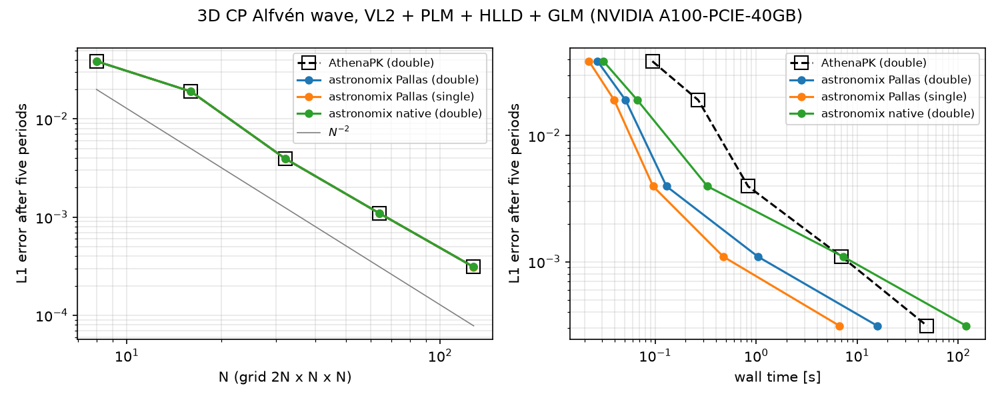

# The VL2 finite-volume scheme of AthenaPK in astronomix

astronomix contains a re-implementation of AthenaPK's default second-order
scheme, with a native-JAX and a Pallas (Triton) backend:

* the van Leer predictor-corrector **VL2** (donor-cell half step, then a full
  step with piecewise-linear reconstruction, harmonic van Leer slopes),
* AthenaPK's Riemann solvers: **HLLD** (Miyoshi & Kusano 2005, with the
  Athena++ degeneracy check), HLLE and LLF for MHD; HLLC, HLLE and LLF for
  hydrodynamics,
* AthenaPK's MHD: cell-centred fields with **GLM divergence cleaning**
  (Dedner et al. 2002) — the cleaning scalar psi is the ninth variable, the
  `(B_n, psi)` subsystem is solved exactly at every face (Mignone &
  Tzeferacos 2010), `c_h` is the largest signal speed, psi is damped by
  `exp(-alpha c_h dt / dx)` each stage; plain or extended Dedner source,
* AthenaPK's options: **first-order flux correction** and density / pressure
  floors.

```python
from astronomix import SimulationConfig, SimulationParams, VL2, HLLD, FINITE_VOLUME

config = SimulationConfig(
    solver_mode=FINITE_VOLUME,
    time_integrator=VL2,       # selects the AthenaPK-equivalent scheme
    riemann_solver=HLLD,       # HLLD / HLL (= HLLE) / LAX_FRIEDRICHS for MHD,
    mhd=True,                  # HLLC / HLL / LAX_FRIEDRICHS for hydro
    # first_order_fallback=True       -> AthenaPK "dc" reconstruction
    # first_order_flux_correction=True -> AthenaPK first_order_flux_correct
    # glm_extended_source=True         -> AthenaPK dedner_extended
    # positivity_config=PositivityConfig(per_step_mode=POSITIVITY_HARD_FLOOR)
    #                                  -> AthenaPK dfloor / pfloor
    #                                     (params.minimum_density / minimum_pressure)
)
params = SimulationParams(C_cfl=0.3, glm_alpha=0.1)  # AthenaPK cfl, glmmhd_alpha
```

The MHD state is `(rho, vx, vy, vz, p, Bx, By, Bz, psi)` in every dimensionality
(`registered_variables.magnetic_psi_index`). Periodic boxes use the
periodic-roll layout, other boundaries two ghost cells. The code is in
`astronomix/_finite_volume/_state_evolution/_van_leer_integrator.py` (driver),
`_van_leer_pallas.py` (Pallas kernels), `_riemann_solver/_athena_riemann_solvers.py`
and `_magnetic_update/_glm_divergence_cleaning.py`; the per-face physics is
written once as elementwise functions that both backends evaluate.

## Agreement with AthenaPK

### Bit-for-bit identity (tested once, in principle)

To establish that the transcription is exact, a development version was
compared with AthenaPK's CPU build (AthenaPK commit `6d31f70`, generic x86-64,
no fused multiply-adds) bit by bit. Started from AthenaPK's own conserved state
and carrying the conserved state like AthenaPK, **complete CP Alfvén wave runs
(N = 8, 16, 32 to t = 5; 99, 205, 415 cycles) were identical to the last bit in
every cell and variable**, including the GLM damping. This required neutralising
three XLA behaviours that are irrelevant for physics: FMA contraction on the CPU
(`--xla_cpu_max_isa=AVX`), XLA's rewriting of divisions by a scalar or a square
root into reciprocal multiplications, and algebraic rewrites through the
definitions of `dt` and `c_h`. Since bit identity has no practical value beyond
this proof, the library code does not contain those guards (it favours readable
code); the bit-exact state is archived at
`/export/data/lstorcks/fv_athenapk/bitexact_snapshot/` (patch against `7fafdf1`
plus the test scripts).

### Round-off agreement of the library code

`compare_to_athenapk.py` runs 19 cases with AthenaPK and astronomix and compares
the final primitive states (largest per-variable relative L1 difference). The
scale for "agreement to round-off" is AthenaPK compared with itself: its GPU and
CPU builds differ only in floating-point details. Results on an A100
(`results/comparison_a100.md`):

| case | cycles | AthenaPK GPU vs CPU | astronomix native vs AthenaPK CPU | astronomix Pallas vs AthenaPK CPU | astronomix Pallas vs AthenaPK GPU |
|---|---|---|---|---|---|
| CP Alfvén 3D (HLLD) | 205 | 5.3e-14 | 6.4e-14 | 6.8e-14 | 6.5e-14 |
| fast wave 3D, amplitude 1e-4 | 36 | 3.1e-12 | 3.8e-12 | 3.8e-12 | 3.5e-12 |
| slow wave 3D, amplitude 1e-4 | 36 | 3.0e-12 | 3.9e-12 | 3.9e-12 | 3.7e-12 |
| entropy wave 3D, advected | 60 | 2.8e-16 | 2.4e-15 | 2.4e-15 | 2.4e-15 |
| Orszag–Tang 128² | 404 | 6.5e-14 | 7.1e-14 | 7.1e-14 | 7.0e-14 |
| Orszag–Tang, extended GLM source | 404 | 6.3e-14 | 7.5e-14 | 7.5e-14 | 8.5e-14 |
| Orszag–Tang, donor cell | 383 | 9.3e-15 | 9.2e-15 | 9.2e-15 | 1.0e-14 |
| field loop (HLLE, alpha 0.4) | 703 | 1.0e-13 | 2.0e-13 | 2.0e-13 | 2.0e-13 |
| magnetized blast 64³ | 89 | 2.0e-13 | 2.0e-13 | 2.0e-13 | 2.0e-13 |
| MHD rotor, outflow | 168 | 9.2e-12 | 1.1e-11 | 1.1e-11 | 9.3e-12 |
| Brio–Wu, outflow | 390 | 5.8e-15 | 6.6e-15 | 6.6e-15 | 5.1e-15 |
| Sod (HLLC) | 224 | 1.2e-15 | 1.8e-15 | 1.8e-15 | 2.2e-15 |
| Sod (HLLE) | 224 | 7.4e-16 | 1.6e-15 | 1.6e-15 | 1.8e-15 |
| sound wave 3D (HLLE) | 36 | 2.1e-12 | 2.7e-12 | 2.7e-12 | 2.6e-12 |
| Sedov 64³ (HLLC, floors) | 58 | 5.4e-16 | 9.2e-16 | 8.4e-16 | 8.7e-16 |
| Einfeldt rarefaction, MHD, FOFC | 260 / 262 | 5.2e-3 | 5.2e-3 | 5.2e-3 | **2.9e-12** |
| colliding flows, MHD, FOFC | 100 | 5.7e-2 | 5.7e-2 | 5.7e-2 | **6.7e-11** |
| low-beta blast, FOFC + floors | 24 | 1.6e-1 | 1.4e-1 | 1.4e-1 | 5.7e-2 |

In every case without an active flux correction, astronomix differs from
AthenaPK by no more than AthenaPK's own builds differ from each other, with the
same number of cycles: the two codes compute the same numbers. (The 1e-12
entries of the linear waves are relative to the 1e-4 wave amplitude.)

**The first-order flux correction.** In the last three cases AthenaPK aborts with
a negative pressure unless the correction is on, so the correction actually
fires. AthenaPK replaces the offending fluxes *in place* during a parallel sweep
over the cells, so whether a cell sees its neighbour's correction within the
same attempt depends on the execution order: AthenaPK's CPU result depends on
the number of OpenMP threads (colliding flows, 16 vs 1 thread: 2.8e-2), its GPU
result can change from run to run (low-beta blast: 3e-3 between identical GPU
runs), and the sequential CPU sweep breaks the mirror symmetry of the symmetric
Einfeldt problem. astronomix checks all cells, then corrects (an order-
independent formulation, deterministic on any hardware); emulating AthenaPK's
sequential sweep instead reproduces AthenaPK's CPU step to 7e-16. On the GPU,
where AthenaPK's threads see the uncorrected fluxes, AthenaPK computes what
astronomix computes: the two agree to 3e-12 and 7e-11 when the corrections do
not cascade. Only with cascading corrections (low-beta blast), where AthenaPK
itself is non-deterministic, do the results differ.

### Regression test

`pytests/mhd/vl2_athenapk_regression.py` compares astronomix with stored AthenaPK
results of eight small cases (`pytests/mhd/data/athenapk_vl2`, written by
`make_regression_data.py`; the two cases with an active flux correction use
AthenaPK's GPU build as the reference, see above): same cycle count and relative
L1 differences below 1e-9 (observed: 1e-15 to 1e-11). It needs no AthenaPK
installation, runs on the CPU in under a minute and additionally tests the
Pallas backend on a GPU.

### Gradients

Derivatives through the Pallas backend are taken through the native stage
(`custom_jvp`). On the CP Alfvén wave (5 steps, with and without the flux
correction) the Pallas and native gradients agree to 1e-15, reverse and forward
mode agree, and both match central finite differences to 2e-9.

### Turbulent driving

The stochastic forcing (`TurbulentForcingConfig`) is applied between steps, so
VL2 runs drive turbulence exactly like the finite-difference scheme: the same
PRNG key gives the same field, and every kick injects exactly `Edot * dt`.
Before this work, finite-volume runs with ghost cells (non-periodic-roll
layouts, e.g. the classic RK2 scheme) generated the field on the padded grid:
wrong wavenumbers, a jump at the box seam and the halo counted in the
normalisation (one kick injected 72 % of `Edot * dt`, and a driven 32³ run
reached a kinetic energy of 0.127 instead of ~0.19 at `Edot t = 0.2`). The field
now lives on the physical grid and is continued periodically into the halo
(`pytests/hydrodynamics/test_turbulent_forcing_layouts.py`). Driven MHD
turbulence with VL2 (64³, Edot = 1, 288 steps to t = 0.5, A100) gives identical
final states on the Pallas and native backends in double precision (0.33 s
against 1.40 s) and agrees to 1.4e-5 in single precision.

## Performance

`benchmark.py` measures the time per step of the CP Alfvén wave
(2N × N × N, VL2 + PLM + HLLD + GLM) for astronomix and AthenaPK on the same
GPU. AthenaPK runs with P. Grete's tuned settings (single meshblock,
`minimum_number_of_teams_for_boundary_kernel = 256`, `scratch_level = 1`); its
figure is its own zone-cycles per second. A100-PCIE-40GB
(`results/benchmark_a100*.json`):

| N | cells | AthenaPK (double) | astronomix Pallas (double) | speed-up | astronomix Pallas (single) | astronomix native (double) |
|---|---|---|---|---|---|---|
| 16 | 8 192 | 0.82 ms | 0.082 ms | 10× | 0.041 ms | 0.12 ms |
| 32 | 65 536 | 1.65 ms | 0.18 ms | 9.4× | 0.073 ms | 0.75 ms |
| 64 | 524 288 | 5.83 ms | 1.20 ms | 4.9× | 0.50 ms | 8.6 ms |
| 128 | 4.2 M | 25.4 ms | 9.25 ms | 2.7× | 3.96 ms | 71.3 ms |
| 256 | 33.6 M | 146 ms | 73.3 ms | 2.0× | 31.9 ms | – |

The Pallas backend sustains ~455 million cell updates per second in double and
~1050 million in single precision independently of the grid size; AthenaPK
needs large grids to approach its throughput (230 million at N = 256).
Temporary device memory at N = 128 is 288 MiB (Pallas, one state-sized buffer)
against 3.8 GiB (native). The fused Pallas kernels take ~30 s to compile.

**Time to solution** (`alfven_convergence.py`, full runs to t = 5 from
AthenaPK's initial state, same A100): the L1 errors and cycle counts of
astronomix equal AthenaPK's at every resolution (N = 128: 3.106316e-4, 1670
cycles); astronomix needs 15.8 s (double) and 6.7 s (single, L1 unchanged in
the first three digits) where AthenaPK needs 49 s.



### Where the time goes

Each VL2 step is one reduction (time step and `c_h`, 0.3 ms at N = 128) and two
fused stage kernels (predictor 3.8 ms, corrector 6.5 ms when timed alone). A
stage kernel reconstructs, solves all six face Riemann problems, forms the
divergence, applies the GLM source and converts to primitives for its cells in
registers, recomputing `U^n` from `W^n`: a whole step moves only ~430 bytes per
cell (~1.8 GB at N = 128, ~1.2 ms at the A100's bandwidth).

The kernels are **FP64-compute bound**. Per cell, the compiled kernels execute
2538 (predictor) and 3309 (corrector) FP64 PTX instructions, including 68 / 152
correctly rounded divisions, 32 reciprocals and 30 / 36 square roots;
weighting these by their instruction expansion gives ~7.4 k FP64-pipe
instructions per cell and step, ~6.4 ms at the A100's FP64 peak against 9.25 ms
measured (~70 % of peak; the card runs at its 250 W power cap). Both kernels use
254–255 registers per thread with negligible spilling (≤ 64 bytes), which limits
occupancy to 8 warps per SM.

Each face flux is evaluated twice (once by each adjacent cell) because the
Triton backend of Pallas cannot shift register tiles (`slice` is not lowered),
so neighbouring cells cannot share a face. Measured cost of this: the step
drops from 9.30 to 5.42 ms if every face were solved once, and the piecewise-
linear reconstruction costs another ~2 ms. Avoiding the duplication the way
AthenaPK does — separate flux arrays and a divergence kernel — would add three
state-sized buffers and roughly 2–3× the DRAM traffic; on the A100 we estimate
at most ~20 % gain from it, and less on GPUs with relatively more FP64
throughput, so the fused kernel is kept. Blocks of 128 cells on four warps (one
cell per thread) perform within 4 % of each other (the default (2, 2, 32) is
used); 64-cell blocks on two warps are 7–12 % and (1, 1, 256) on eight warps 2×
slower.

## Reproducing

AthenaPK (double precision) builds used here: the GPU builds of P. Grete's
reproduction (`~/athena/athenapk-grete/build-{a100,h100}-double`) and a CPU
build configured with

```bash
cmake .. -DCMAKE_BUILD_TYPE=Release -DKokkos_ENABLE_OPENMP=ON \
  -DPARTHENON_DISABLE_MPI=ON -DPARTHENON_DISABLE_OPENPMD=ON \
  -DAthenaPK_ENABLE_TESTING=OFF -DPARTHENON_DISABLE_EXAMPLES=ON
```

```bash
export ATHENAPK_BIN=.../build-cpu-double/bin/athenaPK
export ATHENAPK_GPU_BIN=.../build-a100-double/bin/athenaPK
python compare_to_athenapk.py --backends native,pallas --output results/comparison.json
python benchmark.py --resolutions 16 32 64 128 --output results/benchmark.json
python alfven_convergence.py --resolutions 8 16 32 64 128 --native \
    --output results/convergence.json --figure figures/convergence.png
python make_regression_data.py      # refresh the pytest reference data
```

Cases with their own initial condition (blasts, rotor, Brio–Wu, Einfeldt,
colliding flows) are handed to AthenaPK through a Parthenon restart file
(`athenapk_runner.write_restart_with_state`).
